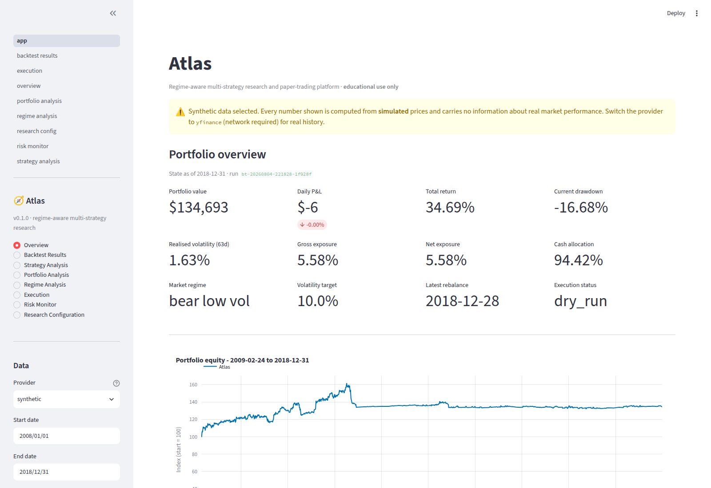
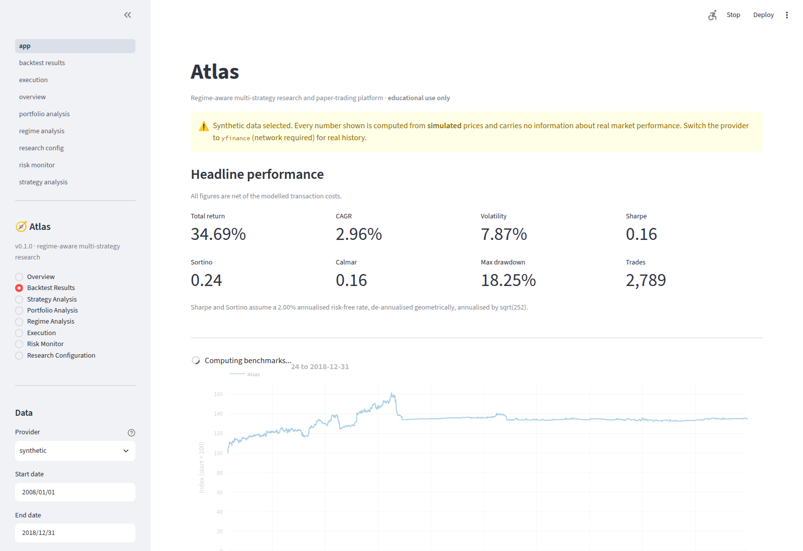
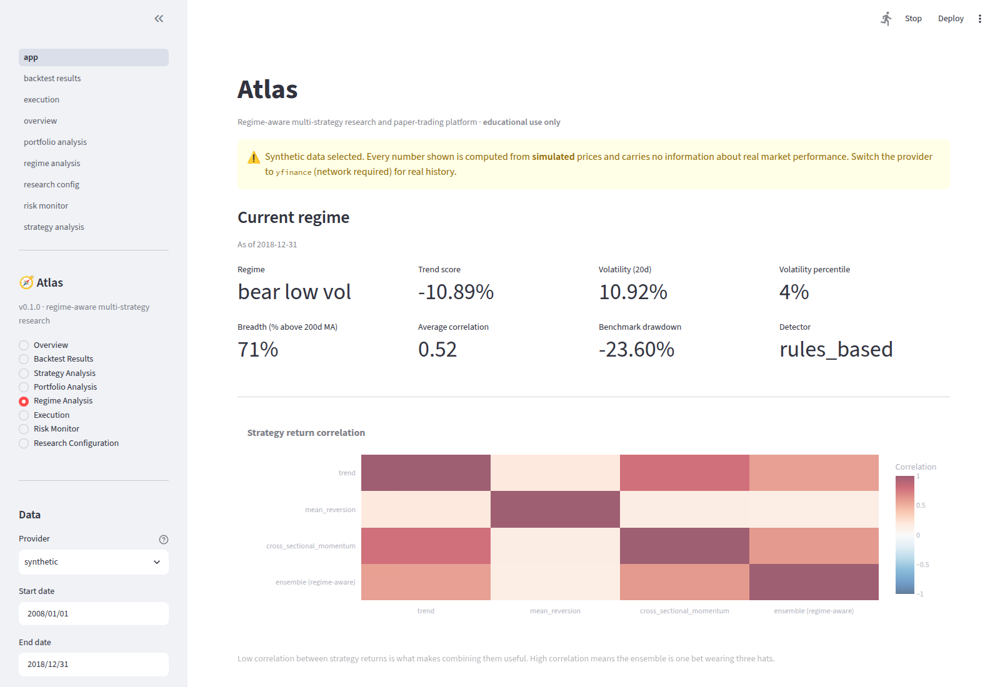
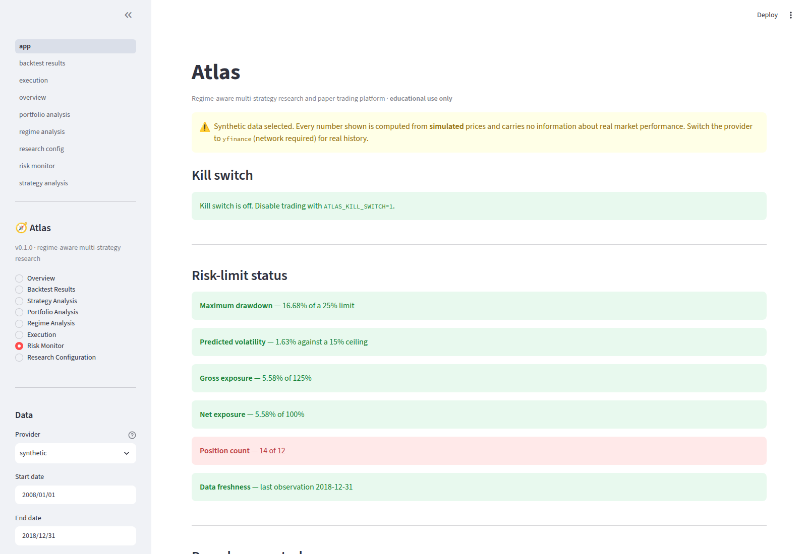

# Atlas

**A regime-aware, multi-strategy research and paper-trading platform.**

[](https://github.com/samj343/atlas/actions/workflows/ci.yml)
[](https://www.python.org)
[](LICENSE)

Atlas combines three systematic strategies across a diversified ETF universe,
allocates risk between them according to the prevailing market regime, sizes
positions to a volatility target under hard constraints, and evaluates the whole
thing with walk-forward out-of-sample testing. It connects to Interactive
Brokers for **paper** execution.

> **Atlas is an educational research and paper-trading system. Historical
> performance does not guarantee future results. Paper-trading execution does not
> replicate all real-world liquidity, slippage, latency, and fill conditions.**

Live trading is **not implemented**. `EXECUTION_MODE=live` is rejected at
configuration load and again by the pre-trade safety gate.

---

## Why this exists

Most backtest code answers *"what would this rule have returned?"*. That is the
easy question, and the answer is almost always flattering. Atlas is built around
the harder ones:

- **Is the result real, or is it look-ahead?** Every feature is backward-looking
  and every order fills a bar after its signal — and `tests/unit/test_lookahead.py`
  *proves* it by multiplying all future prices by 1.5 and asserting that no
  historical feature, signal or regime label moves.
- **What does it cost to trade?** Commission, half-spread, slippage and
  square-root market impact are modelled separately, and the report shows gross
  performance, net performance, and the share of gross return consumed by costs.
- **How much of it survives out of sample?** Walk-forward validation reports
  `train_minus_test_sharpe` prominently. That gap, not the in-sample Sharpe, is
  the honest measure.
- **Does it depend on one lucky parameter?** The stability sweep flags any
  parameter where the best value beats the median by too much.
- **What stops it when it is wrong?** A risk manager that knows nothing about
  strategies, and cannot be disabled by a bug in one.

---

## Screenshots

| Overview | Backtest results |
|---|---|
|  |  |

| Regime analysis | Risk monitor |
|---|---|
|  |  |

*(Captured from the synthetic-data demo, which is why the banner says so.)*

---

## Quick start

```bash
git clone https://github.com/samj343/atlas.git
cd atlas
make install                    # venv + editable install with dev extras

# No network needed - deterministic simulated prices
.venv/bin/atlas backtest --provider synthetic --start 2010-01-01 --end 2018-12-31

# Real market history (needs outbound HTTPS to Yahoo Finance)
.venv/bin/atlas download-data --provider yfinance
.venv/bin/atlas backtest --provider yfinance

.venv/bin/atlas dashboard       # http://localhost:8501
```

Every command prints a research report path when it finishes.

---

## Architecture

```
                        configs/*.yaml  (pydantic-validated)
                                |
   +----------+-----------------+---------------+-------------+
   v          v                 v               v             v
 data     strategies        regimes        portfolio      execution
  |            |                |               |             |
  |            +--------+-------+               |             |
  |                     v                       |             |
  |                 ensemble ----------------->  |            |
  |                                              v            v
  +--------------------> backtest.engine <-- risk_manager --> broker
                                |
                 +--------------+--------------+
                 v              v              v
             metrics       validation      database
                                |              |
                                v              v
                            reporting  <--- dashboard
```

Dependencies point inward. `strategies` never imports `portfolio`; `portfolio`
never imports `execution`; research code never imports the dashboard.

See [docs/architecture.md](docs/architecture.md).

---

## The three strategies

| Strategy | Idea | Why it might work |
|---|---|---|
| **Trend following** | Blend of price-vs-moving-average and volatility-normalised 63/252-day returns | Time-series momentum premium (Moskowitz, Ooi & Pedersen 2012): slow information diffusion, under-reaction, forced trading by leveraged holders |
| **Mean reversion** | Fade large 5-day moves measured by z-score and RSI | Compensation for short-horizon liquidity provision (Nagel 2012) |
| **Cross-sectional momentum** | Rank assets by risk-adjusted 12-month return, skipping the last month | Relative-strength persistence (Jegadeesh & Titman 1993) |

Each returns a continuous signal in `[-1, 1]` expressing **direction and
conviction** — never a portfolio weight.

Two deliberate deviations from the naive formulation, both documented in
[docs/methodology.md](docs/methodology.md):

- Trend uses a volatility-scaled `tanh` instead of `sign(P/MA - 1)`. `sign` flips
  discontinuously whenever price grazes the average, and each flip costs a round
  trip; `tanh` keeps the meaning and removes the turnover.
- Cross-sectional momentum demeans scores **within asset class** by default. With
  four US equity ETFs in a fourteen-asset universe, an unmodified ranking puts all
  four at the top in any equity bull market — one bet in four disguises.

---

## Regimes and risk allocation

Two observable quantities, crossed: is the benchmark above its 200-day moving
average, and is 20-day realised volatility above the 70th percentile of its own
*expanding* history?

|  | Low volatility | High volatility |
|---|---|---|
| **Above trend** | `bull_low_vol` | `bull_high_vol` |
| **Below trend** | `bear_low_vol` | `bear_high_vol` |

A percentile, not an absolute threshold: a fixed "VIX > 20" rule misclassifies
both 2017 and 2008 at different points in a long sample.

Strategy weights and the risk multiplier are read **from configuration** per
regime. They are never optimised on returns — in-sample optimisation of ensemble
weights is the fastest route to a result that does not survive walk-forward.

```yaml
bear_high_vol:
  trend: 0.60
  mean_reversion: 0.10
  cross_sectional_momentum: 0.30
  risk_multiplier: 0.50
  defensive_weight: 0.20
```

---

## Portfolio construction

1. **Inverse-volatility scaling** — `w̃ᵢ = sᵢ / σᵢ`, so a unit of conviction buys
   the same *risk* in a 30%-vol equity ETF as in a 5%-vol bond ETF.
2. **Gross normalisation** — `wᵢ = w̃ᵢ / Σ|w̃ⱼ|`.
3. **Volatility targeting** — scale by `σ_target / √(wᵀΣw)`, with the scaler
   clipped so a low predicted volatility cannot manufacture leverage.
4. **Risk multipliers** — regime × drawdown, never above 1.
5. **Constraints** — projected in a fixed order, each adjustment recorded with a
   reason.

Covariance defaults to **Ledoit-Wolf shrinkage**; sample and EWMA are available.
Every estimate is repaired to positive definite, and the fallback when estimation
fails is a *diagonal* matrix — conservative, because ignoring diversification
makes the volatility target bind sooner rather than later.

---

## Risk management

The risk manager is **independent of strategy logic**: it knows nothing about
moving averages, so a strategy bug cannot disable a risk control.

**Position** — max 20% per symbol, 50% per asset class, 1.25× gross, 1.00× net,
12 positions, order notional bounds.

**Portfolio** — 10% volatility target, 15% predicted-volatility ceiling, drawdown
ladder, 4% daily / 8% weekly loss limits, 30% daily turnover cap,
correlation-concentration warning.

**Operational** — stale-data rejection, missing-price handling, duplicate-order
suppression, trading-window enforcement, buying-power check, reconciliation
blocking, consecutive-API-failure halt, and a global kill switch.

Two decisions worth highlighting, because both were bugs before they were
features:

- **The drawdown ladder measures against a rolling two-year peak, not the
  all-time high.** Against an all-time peak it is a one-way ratchet: a portfolio
  cut to a quarter of its risk budget cannot earn back to the old high, so the
  reduction never lifts and one bad year disables the strategy permanently.
- **Loss limits are circuit breakers, not shutdowns.** They lift automatically
  after a cool-off *provided the limit is no longer breached*. Halts needing human
  judgement — unreconciled positions, repeated API failures, the kill switch —
  never auto-resume.

See [docs/risk_management.md](docs/risk_management.md).

---

## Backtesting

Event-driven, one bar at a time. Per bar: reveal data → fill yesterday's orders
at today's **open** → credit dividends → mark to market → (on schedule) generate
signals, build targets, run risk checks, queue orders for tomorrow.

A signal from the close of day *t* is **never** executed at that same close.
The only way to get that behaviour is to explicitly select
`execution_timing: same_close_unrealistic`, which warns on every run and is
flagged in the result object.

The simulated broker models rejections, partial fills against a participation
cap, whole-share rounding, uncrossed limit orders, and sells settling before
buys. It is deterministic.

See [docs/backtesting.md](docs/backtesting.md).

---

## Validation

**Walk-forward** — rolling train/validation/test windows with an embargo gap.
Candidates are scored on the validation slice by a multi-objective function that
penalises drawdown, turnover and train-validation instability — *not* raw return.
The winner is frozen and only the unseen test slice is reported. The default grid
is 12 combinations and the config model rejects anything above 500.

**Parameter stability** — one-at-a-time sweeps, run both net and gross of costs,
flagging parameters where performance depends on the specific value rather than
a broad plateau.

**Stress periods** — 2008, 2011, 2015-16, Q4 2018, 2020, 2022, 2023, reported as
a panel. Consistency across windows is the signal; one good crisis is not.

**Block bootstrap** — contiguous blocks, preserving volatility clustering.
Labelled throughout as a statistical stress test, **not a forecast**.

**Eight benchmarks** — SPY, 60/40, equal-weight universe, each strategy alone,
the equal-weight ensemble and the regime-aware ensemble. The strategy variants
run through *identical* portfolio, cost and risk machinery, so a difference is
attributable to the signal rather than the plumbing.

---

## Baseline experiment

```bash
python scripts/run_baseline_experiment.py --provider yfinance
```

Daily data, full history, weekly rebalancing, 10% volatility target, long-only,
trend 40% / mean reversion 25% / cross-sectional momentum 35%, realistic costs,
walk-forward evaluation, all eight benchmarks. Writes a full HTML research
report.

**On results in this repository:** the environment this project was built in has
no outbound access to Yahoo Finance, so the committed artefacts come from the
deterministic **synthetic** provider and are labelled as such everywhere — in the
console, in the report banner, and in the stored manifest. They demonstrate that
every component runs and that the risk controls behave as specified. **They carry
no information about real market performance.** Run the command above with
network access to reproduce it on real history.

Atlas never fabricates a metric. If data cannot be retrieved, the experiment
stops and prints setup instructions.

---

## Command line

```bash
atlas info                     # configuration summary and status
atlas download-data            # fetch and cache history
atlas validate-data            # data quality report
atlas backtest                 # backtest + benchmarks + stress + HTML report
atlas walk-forward             # out-of-sample validation
atlas parameter-stability      # fragility sweep
atlas runs                     # list stored runs
atlas generate-report --run-id RUN_ID
atlas dashboard                # Streamlit UI
atlas broker-check             # connect and run every safety check
atlas order-preview            # show the orders it would place (sends nothing)
atlas paper-trade              # submit to an IBKR paper account
atlas reconcile                # compare broker and local positions
atlas show-config              # print the validated configuration
```

Exit codes: `0` success, `1` runtime failure, `2` bad configuration, `3` risk or
safety block, `4` broker failure.

---

## Dashboard

```bash
atlas dashboard
```

Eight pages: **Overview**, **Backtest Results**, **Strategy Analysis**,
**Portfolio Analysis**, **Regime Analysis**, **Execution**, **Risk Monitor**,
**Research Configuration**.

The dashboard is a *viewer*. It cannot submit an order or rewrite a
configuration file — those belong on the command line, where they are logged and
auditable.

---

## Interactive Brokers

```bash
pip install -e ".[broker]"
cp .env.example .env            # set ATLAS_IBKR_ACCOUNT_ALLOWLIST
atlas broker-check
atlas order-preview
EXECUTION_MODE=paper atlas paper-trade
```

Atlas refuses to trade any account that does not look like an IBKR paper account
(`DU`/`DF` prefix), and refuses to submit at all unless the account is on an
explicit allowlist. Full walkthrough: [docs/ibkr_setup.md](docs/ibkr_setup.md).

---

## Testing

```bash
make test          # fast suite
make test-all      # everything, including slow walk-forward tests
make coverage
make check         # lint + type-check + test
```

459 tests (456 fast, 3 marked slow). The ones that matter most:

- `tests/unit/test_lookahead.py` — perturbs the future, asserts the past does not
  move; checks that walk-forward windows never overlap and that no fill lands on
  its own signal bar.
- `tests/unit/test_risk.py` — every limit, the kill switch, the halt cool-off,
  and the drawdown-ratchet regression.
- `tests/unit/test_edge_cases.py` — empty data, singular covariance, zero
  volatility, negative cash, rejected and partial fills, API disconnection,
  duplicate orders, extreme price moves.
- `tests/integration/` — full pipeline, database round trip, report generation,
  and the whole execution path against a mock broker.

No test touches the network or a broker.

---

## Installation

```bash
# Standard
python3.12 -m venv .venv && source .venv/bin/activate
pip install -e ".[dev,data,dashboard]"

# With the broker client
pip install -e ".[all,dev]"

# Docker
docker compose up dashboard              # http://localhost:8501
docker compose run --rm backtest
docker compose run --rm tests
```

Requires Python 3.11+ (CI runs 3.11 and 3.12).

---

## Repository layout

```
atlas/
├── configs/          YAML configuration (validated by pydantic)
├── docs/             architecture, methodology, backtesting, risk, IBKR, limitations
├── notebooks/        research_examples.ipynb
├── scripts/          download_data, run_backtest, run_walk_forward,
│                     run_paper_trader, run_baseline_experiment, generate_report
├── src/atlas/
│   ├── config.py     typed configuration for everything
│   ├── cli.py        command-line interface
│   ├── data/         providers, caching loader, validation, features
│   ├── strategies/   trend, mean reversion, cross-sectional momentum, ensemble
│   ├── regimes/      rules-based detection (+ optional clustering)
│   ├── portfolio/    volatility, covariance, constraints, allocator, risk manager
│   ├── backtest/     event engine, simulated broker, costs, orders, positions, metrics
│   ├── validation/   walk-forward, stability, stress tests, benchmarks
│   ├── execution/    IBKR client, order manager, reconciliation, safety gate
│   ├── database/     SQLAlchemy models, session, repository
│   ├── reporting/    charts, research report, export
│   └── dashboard/    Streamlit app, views, components
└── tests/            unit, integration, fixtures
```

---

## Limitations

Read [docs/limitations.md](docs/limitations.md) before drawing any conclusion.
The short version:

- Backtests are not evidence of skill; only the walk-forward test slices are out
  of sample, and even those come from a process informed by the whole sample.
- The universe is fourteen ETFs that exist and are liquid *today* — survivorship
  and selection bias are present and uncorrected.
- Free adjusted prices are revised retroactively, so a result is not exactly
  reproducible from the vendor alone.
- The cost model is an approximation, and it errs in the flattering direction:
  spreads widen exactly when the strategy most wants to trade.
- **Paper fills are not real fills.** This is the largest gap between these
  results and reality.
- A handful of crises is a very small sample for any claim about tail behaviour.

---

## Roadmap

Deliberately not implemented, in rough priority order:

- [ ] Clustering/HMM regime detector evaluated against the rules-based baseline
      (scaffolding exists; off by default and must never silently replace it)
- [ ] Alternative data providers (Polygon, Tiingo, a vendor with point-in-time
      adjustments)
- [ ] Intraday execution modelling: VWAP/TWAP slicing, queue position
- [ ] Futures and FX with proper margin and roll modelling
- [ ] Multi-account and multi-currency support
- [ ] Live trading — **only** after paper execution has been validated against
      real fills over a meaningful period

---

## Disclaimer

**Atlas is an educational research and paper-trading system. Historical
performance does not guarantee future results. Paper-trading execution does not
replicate all real-world liquidity, slippage, latency, and fill conditions.**

Nothing here is investment advice. No strategy in this repository is claimed to
be profitable. Live trading is not implemented and is disabled by two independent
checks.

## License

MIT — see [LICENSE](LICENSE).
